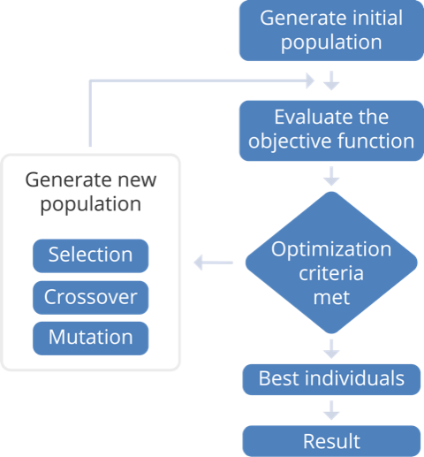

# Traveling Salesman Problem in MapReduce and Spark

This is a project for the course DAT500 at University in Stavanger, Norway.
We implemented several genetic algorithms so we could investigate how parallelization affects performance of the algorithm.

Algorithms implemented:
* Sequential genetic algorithm (SGA)
* Mrjob:
    * Global
    * Island
* Spark
    * Global
    * Island

## Genetic algorithm

GAs according to Wikipedia:

> In computer science and operations research, a genetic algorithm (GA) is a metaheuristic inspired by the process of natural selection that belongs to the larger class of evolutionary algorithms (EA). Genetic algorithms are commonly used to generate high-quality solutions to optimization and search problems by relying on bio-inspired operators such as mutation, crossover and selection.


Genetic algorithms are especially useful when exhaustive search is not feasible because of the complexity of the problem. If set up correctly, they yield high value results.

Basic genetic algorithm structure:




### Parallel genetic algorithms

Parallel genetic algorithms parallelize certain portions of sequential genetic algorithm. In global parallel algorithm we parallelize crossover, mutation and fitness evaluation. In island model we run SGAs in parallel and at certain intervals we migrate parts of populations between "islands".

## Installation

### Requirements

* Python
* Java
* Hadoop
* Spark

Algorithm was tested on Ubuntu 16.04.6, Python 3.8.2, Java 1.8, Hadoop 3.2.1., Spark 3.0.0-preview2.

After creating python environment install the dependences:

`python -m pip install -r requirements.txt`

Next we set up environmental variables:

``` shell
export SPARK_HOME=<path-to-spark>
export PATH=$PATH:$SPARK_HOME/bin
export PYSPARK_PYTHON=<path-to-env-python>
export PYSPARK_DRIVER_PYTHON=<path-to-env-python>
export PYTHONPATH=$SPARK_HOME/python:$SPARK_HOME/python/lib/py4j-<py4j-version>-src.zip:$PYTHONPATH
```

## Running the code

Before running the genetic algorithm code we need to create a set of locations. Locations should be stored in a file `data/locations.json` as a list of lists with each inner list being coordinates of a location. We can also generate random locations running the command:

```shell
python locations.py <number-of-locations> <dimensions>
```

Running the code from command line has the form:

``` shell
python Driver.py -t <model type> <options>
```

Some examples:

``` shell
python Driver.py  \
    --num_iterations 500 --population_size 120 --num_locations 30 
```
Will run sequential GA with number of iterations = 500, population size 120 and number of location = 30 (can be a subset of locations in `locations.json` file).


``` shell
python Driver.py -t global-s --spark-master yarn  \
     -n 500 -p 120 -l 30
```
Will run global parallel model in Hadoop cluster with Spark. The model has the same parameters as the one above.


``` shell
python Driver.py -t island -r hadoop \
    -n 100 -p 40 -l 30 \
    --num_islands 3 \
    --num_migrations 4
```
Example of an island model in MapReduce on Hadoop cluster. 
Note that the parameters are the same as in the previous examples because here we specify population size per island (40\*3=120) and number of iterations in between migrations (100\*(4+1)=500).

